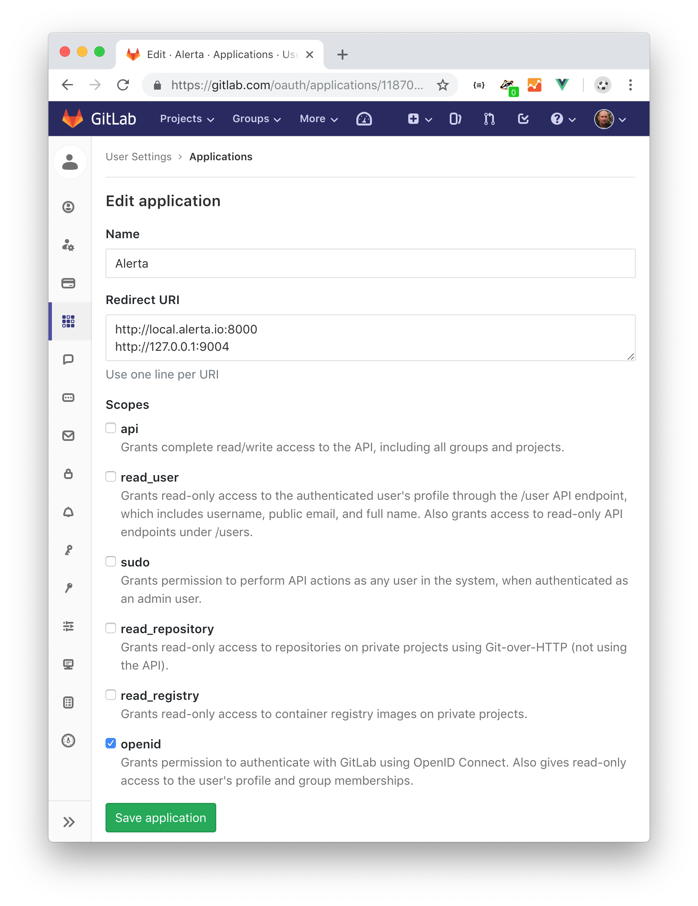

.. _authentication:

Authentication
==============

By default, authentication is not enabled, however there are some features
that are :ref:`not available <watched_alerts>` unless users login such as
watching alerts.

Alerta supports five main authentication strategies:

* `Basic Auth`_
* :ref:`LDAP <ldap_auth>`
* :ref:`OpenID Connect <oidc_auth>`
* :ref:`SAML 2.0 <saml2_auth>`
* :ref:`OAuth2 <github_oauth2>` (*Note: only used by GitHub*)

The OpenID Connect authentication strategy can be used to integrate with
any `OIDC compliant`_ auth provider however Alerta has specific
implementations for some auth providers to simplify the integration:

* :ref:`Azure Active Directory <azure_ad_oidc>`
* `Amazon Cognito`_
* `GitLab OAuth2`_
* `Google OAuth2`_
* `Keycloak OAuth2`_

Alerta also supports two "machine-to-machine" authentication strategies:

* `API Keys`_
* `HMAC Auth`_

.. _OIDC compliant: https://openid.net/developers/certified/

To enforce authentication set ``AUTH_REQUIRED`` to ``True`` and set the
``SECRET_KEY`` to some random string in the ``alertad.conf`` server
configuration settings file::

    AUTH_REQUIRED = True
    SECRET_KEY = 'ZWU2YTU0Zjg2MDkyY2RmYmRlNDM4MjYzNWQzMWMxYzQK'

.. note::
    Ensure that the :envvar:`SECRET_KEY` that is used to encode tokens
    and API keys is a unique, randomly generated sequence of ASCII
    characters. The following command generates a suitable 32-character
    random string on Linux::

        $ LC_CTYPE=C tr -dc A-Za-z0-9_\!\@\#\$\%\^\&\*\(\)-+= < /dev/urandom | head -c 32 && echo

    or Mac OSX::

        $ date | md5 | base64

.. _basic_auth:

Basic Auth
----------

Basic Auth (built-in)
~~~~~~~~~~~~~~~~~~~~~

The most straight-forward authentication strategy to implement of the
four is HTTP `Basic Authentication`_ provided by the Alerta API
because there is no additional configuration required of the Alerta
server to use it other than setting ``AUTH_REQUIRED`` to ``True``.

.. _Basic Authentication: https://en.wikipedia.org/wiki/Basic_access_authentication

.. note::
    HTTP Basic Auth does not provide any encryption of the username
    or password so it is strongly advised to only use Basic Auth over
    HTTPS.

.. warning:: add example

.. _ldap_auth:

Basic Auth using LDAP
~~~~~~~~~~~~~~~~~~~~~

LDAP can be used as the Basic Auth provider to authenticate users
if desired by setting the ``AUTH_PROVIDER`` to ``ldap``.

It requires the installation of an additional Python package
called "`python-ldap`_" and can be installed using::

    $ pip install python-ldap

.. _`python-ldap`: https://pypi.org/project/python-ldap/

.. important::
    If the Alerta API is installed in a Python virtual
    environment ensure that the ``python-ldap`` package is installed
    into the same environment otherwise it won't be auto-detected.

The configuration settings for LDAP authentication include the LDAP
server URL and a map of LDAP domains to search filters which means
that multiple LDAP domains can be supported.

**Example**

.. code:: python

    AUTH_PROVIDER = 'ldap'
    LDAP_URL = 'ldap://localhost:389'  # replace with your LDAP server
    LDAP_DOMAINS = {
        'my-domain.com': 'uid=%s,ou=users,dc=my-domain,dc=com'
    }
    LDAP_DOMAINS_BASEDN = {
        'my-domain.com': 'dc=my-domain,dc=com'
    }
    LDAP_DOMAINS_GROUP = {
        'my-domain.com': '(&(memberUid={username})(objectClass=groupOfUniqueNames))'
        #OR
        'my-domain.com': '(&(member={userdn})(objectClass=groupOfUniqueNames))'
        #OR
        'my-domain.com': '(&(member={email})(objectClass=groupOfUniqueNames))'
    }

.. warning:: improve example

A typical user called ``user1``, for the example above, would login
using an email address of ``user1@my-domain.com`` even if that
email address doesn't actually exist.

You can fetch ldap groups dynamically from LDAP server and use them as customer
name by using ``LDAP_DOMAINS_GROUP`` configuration. Either of ``{username}``,
``{userdn}`` or ``{email}`` can be used for the same.

All users are initially assigned the "user" role by default.

.. note:: User sign-up, email verfication and password reset through the
    Alerta web UI or CLI is not supported. Self-service user management
    needs to be handled by the LDAP authentication provider.

.. _oidc_auth:

OpenID Connect
--------------

::

    # OpenID Connect
    OIDC_ISSUER_URL = None
    OIDC_AUTH_URL = None
    OIDC_LOGOUT_URL = None
    OIDC_VERIFY_TOKEN = False
    OIDC_ROLE_CLAIM = OIDC_CUSTOM_CLAIM = 'roles' # JWT claim name whose value is used in role mapping
    OIDC_GROUP_CLAIM = 'groups' # JWT claim name whose value is used in customer mapping
    ALLOWED_OIDC_ROLES = ALLOWED_GITLAB_GROUPS or ALLOWED_KEYCLOAK_ROLES or ['*']

.. _saml2_auth:

SAML 2.0
--------

To use SAML as the authentication provider for Alerta, install `PySAML2`_ on the Alerta
server and follow the configuration steps below.

.. _PySAML2: https://pysaml2.readthedocs.io

::

    $ pip install PySAML2

Generate private/public key pair:

::

    $ openssl req -utf8 -new -x509 -days 3652 -nodes -out "alerta.cert" -keyout "alerta.key"

.. note::

    This key pair is not related to HTTPS.

Configure pysaml2:

Bare-minimum config example::

    AUTH_PROVIDER = 'saml2'
    SAML2_CONFIG = {
        'metadata': {
            'local': ['/path/to/federationmetadata.xml']
        },
        'key_file': '/path/to/alerta.key',
        'cert_file': '/path/to/alerta.cert'
    }

..

``metadata``
    IdP metadata (refer to `saml2 documentation <https://pysaml2.readthedocs.io/en/latest/howto/config.html#metadata>`_ for possible ways of specifying it)
``key_file``, ``cert_file``
    path to aforementioned keys

Refer to pysaml2 documentation and source code if you need additional options:

- https://pysaml2.readthedocs.io/en/latest/howto/config.html
- https://github.com/rohe/pysaml2/blob/master/src/saml2/config.py

Note: entityid and service provider endpoints are configured by default based on your BASE_URL value which is mandatory if you use SAML (see :ref:`general config`)

``ALLOWED_SAML2_GROUPS``

To restrict access to users who are members of particular group use::

    ALLOWED_SAML2_GROUPS = ['alerta_ro', 'alerta_rw']

.. note::

    Ensure that pysaml2 authn response identity object contains ``groups``
    attribute. You can do this by writing proper attribute map which will
    convert your IdP-specific attribute name to ``groups``.

Example::

    MAP = {
        ...
        'fro': {
            ...
            'http://schemas.xmlsoap.org/claims/group': 'groups',
            ...
        },
        'to': {
            ...
            'groups': 'http://schemas.xmlsoap.org/claims/group',
            ...
        }
    }

..

See `pysaml2 attribute-map-dir documentation <https://pysaml2.readthedocs.io/en/latest/howto/config.html#attribute-map-dir>`_.
The ``attribute-map-dir`` can be specified in the ``SAML2_CONFIG``.

``SAML2_USER_NAME_FORMAT``

The username format can be customized using the ``SAML2_USER_NAME_FORMAT``
setting. It is a python string template which is used to generate user's name
based on attributes (make sure that `attribute-map-dir <https://pysaml2.readthedocs.io/en/latest/howto/config.html#attribute-map-dir>`_
is properly configured in case default does not fit).

Default is ``'{givenName} {surname}'``.

.. _cross_origin_saml2:

``CORS_ORIGINS``

You also need to add your IdP origin to CORS headers::

    CORS_ORIGINS = [
        ...
        'https://sso.example.com',
        ...
    ]

..

Add trusted Service Provider to your Identity Provider

Your metadata url is: ``{BASE_URL}/auth/saml/metadata.xml``, pass it to your IdP administrator.

::

    # SAML 2.0
    SAML2_ENTITY_ID = None
    SAML2_METADATA_URL = None
    SAML2_USER_NAME_FORMAT = '{givenName} {surname}'
    SAML2_EMAIL_ATTRIBUTE = 'emailAddress'
    SAML2_CONFIG = {} # type: Dict[str, Any]
    ALLOWED_SAML2_GROUPS = ['*']

.. _github_oauth2:

GitHub OAuth2
~~~~~~~~~~~~~

To use GitHub as the OAuth2 provider for Alerta, login to GitHub and go
to *Settings -> Applications -> Register New Application*.

- Application Name: Alerta
- Homepage URL: http://alerta.io
- Application description (optional): Guardian Alerta monitoring system
- Authorization callback URL: http://alerta.example.com

.. note:: The `Authorization callback URL` is the most important setting
          and it is nothing more than the URL domain (ie. without any path)
          where the alerta Web UI is being hosted.

Click Register Application and take note of the Client ID and Client
Secret. Then configuration settings for ``alerta`` server are as follows::

    AUTH_PROVIDER = 'github'
    OAUTH2_CLIENT_ID = 'f7b0c15e2b722e0e38f4'
    OAUTH2_CLIENT_SECRET = '7aa9094369b72937910badab0424dc7393x8mpl3'

.. _allowed_github_orgs:

To restrict access to users who are members of particular
`GitHub organisations`_ use::

    ALLOWED_GITHUB_ORGS = ['example', 'mycompany']

.. _`GitHub organisations`: https://github.com/blog/674-introducing-organizations

.. note:: ``ALLOWED_GITHUB_ORGS`` can be an asterisk (``*``) to force login
          but *not* restrict who can login.

.. important:: To revoke access of your instance of alerta to your GitHub
               user info at any time go to
               *Settings -> Applications -> Authorized* applications, find
               alerta in the list of applications and click the **Revoke**
               button.

.. _GitHub: https://developer.github.com/v3/oauth/

.. _helper_auth:

OIDC Providers
--------------

OpenID Connect authentication is provided by Google_ `OAuth2`_,
GitLab_ `OAuth 2.0`_ or Keycloak_ `OAuth 2.0`_ and configuration is more
involved than the Basic Auth setup.

.. note::
    If Alerta is deployed to a publicly accessible web server
    it is important to configure the OAuth2 settings correctly to
    ensure that only authorised users can access and modify your
    alerts.

.. _Google: https://developers.google.com/accounts/docs/OpenIDConnect
.. _GitLab: https://docs.gitlab.com/ce/integration/oauth_provider.html
.. _Keycloak: https://www.keycloak.org/documentation.html
.. _OAuth 2.0: http://tools.ietf.org/html/draft-ietf-oauth-v2-22
.. _OpenID Connect: http://openid.net/connect/

Ensure ``AUTH_REQUIRED`` and ``SECRET_KEY`` are set and that the
``AUTH_PROVIDER`` setting is set to the correct provider.

Then follow the steps below for the chosen OAuth provider to create an
OAuth client ID and client secret. The client ID and client secret
will need to be added to the ``alertad.conf`` file for the Alerta server.

.. _azure_ad_oidc:

Azure Active Directory
~~~~~~~~~~~~~~~~~~~~~~

To use `Azure Active Directory`_ (now known as `Microsoft identity platform (v2.0)`_) as
the OpenID Connect authentication provider for Alerta follow the steps below.

#. Login to Azure portal
    https://portal.azure.com/

#. Navigate to "Azure Active Directory" service page

#. From the "Manage" sidebar choose "App registrations"

#. Click the button that says "New registration"
    Fill in the "Register an application" form for your environment:

    - Name: Alerta AD
    - Supported Account Types: Multitenant and Personal (common)
    - Redirect URI: (web) https://alerta.example.com

    ... and click the "Register" button.

    .. note::

        The ``AZURE_TENANT`` setting will vary depending on what
        "Supported Account Type" is chosen. It will be either "common",
        "organizations", "consumers" or a tenant ID. To check which
        account type click the "Endpoints" button on the "Overview"
        page and check the "OpenID Connect metadata document" URL.

        **Example of OpenID Connect metadata URL for "organizations"**

        https://login.microsoftonline.com/organizations/v2.0/.well-known/openid-configuration

    Copy the App registration details for client ID, for example:

    Application (client) ID: ``3aab3fa8-cb9b-457f-8283-811d1ebd4975``

#. From the "Manage" sidebar again choose "Certificates & secrets"

    Click the "New client secret" button

    Add description "Alerta Web UI" and choose an expiry time

    Copy the client secret, for example:

    ``jj2cw7~nc1.55l3.UAy8C3O9Ng-.~GYWYp``

#. Add the above details to the Alerta server configuration file, like so:

.. code:: python

    AZURE_TENANT = 'common'
    OAUTH2_CLIENT_ID = '3aab3fa8-cb9b-457f-8283-811d1ebd4975'
    OAUTH2_CLIENT_SECRET = 'jj2cw7~nc1.55l3.UAy8C3O9Ng-.~GYWYp'

.. _Azure Active Directory: https://docs.microsoft.com/en-us/azure/active-directory/develop/v2-protocols-oidc
.. _Microsoft identity platform (v2.0): https://docs.microsoft.com/en-us/azure/active-directory/develop/about-microsoft-identity-platform

Amazon Cognito
~~~~~~~~~~~~~~

.. note:: TBC

.. _gitlab_oauth2:

GitLab OAuth2
~~~~~~~~~~~~~

To use GitLab as the OAuth2 provider for Alerta, login to GitLab and go
to *Profile Settings -> Applications -> New Application*.

- Name: Alerta
- Callback URL: http://alerta.example.com
- Scopes: ``openid``

.. note:: The `Callback URL` is the most important setting and it
          is nothing more than the URL domain (ie. without any path)
          where the alerta Web UI is being hosted.

Click *Submit* and take note of the Application ID and Secret. Then
configuration settings for ``alerta`` server are as follows (replacing
the values shown below with the values generated by GitLab)::

    AUTH_PROVIDER = 'gitlab'
    GITLAB_URL = 'https://gitlab.com'  # or your own GitLab server
    OAUTH2_CLIENT_ID = 'd31e9caa131f72901b16d22289c824f423bd5cbf187a11245f402e8b2707d591'
    OAUTH2_CLIENT_SECRET = '42f1de369ec706996cadda234986779eeb65c0201a6f286b9751b1f845d62c8a'

.. _allowed_gitlab_groups:

To restrict access to users who are members of particular `GitLab groups`_ use::

    ALLOWED_GITLAB_GROUPS = ['group1', 'group2']

.. _`GitLab groups`: https://docs.gitlab.com/ee/user/group/index.html

.. note:: ``ALLOWED_GITLAB_GROUPS`` can be an asterisk (``*``) to force
          login but *not* restrict who can login.

.. important:: To revoke access of your instance of alerta to your
               GitLab user info at any time go to
               *Profile Settings -> Applications -> Authorized appliations*,
               find alerta in the list of applications and click the **Revoke**
               button.

.. _google oauth2:

Google OAuth2
~~~~~~~~~~~~~

To use Google as the OAuth2 provider for Alerta, login to the
`Google Developer Console`_ and create a new project for alerta.

.. _Google Developer Console: https://console.developers.google.com

- Project Name: alerta
- Project ID: (automatically assigned)

Next go to *APIs & Services* and select *Credentials* from the
sidebar menu. Click **Create credentials** and choose "OAuth
client ID" and "Web Application" for application type.

- Name: Alerta
- Authorized Javscript Origins: http://alerta.example.com
- Authorized Redirect URIs: http://alerta.example.com

Click **Create** and take note of the Client ID and Client
Secret. Use this information to configure the settings for
``alerta`` server.

**Example**

.. code:: python

    AUTH_PROVIDER = 'google'
    OAUTH2_CLIENT_ID = '379647311730-sj130ru952o3o7ig8u0ts8np2ojivr8d.apps.googleusercontent.com'
    OAUTH2_CLIENT_SECRET = '8HrqJhbrYn9oDtaJqExample'

or using 'openid'::

    AUTH_PROVIDER = 'openid'
    OIDC_ISSUER_URL = 'https://accounts.google.com'
    OAUTH2_CLIENT_ID = '379647311730-sj130ru952o3o7ig8u0ts8np2ojivr8d.apps.googleusercontent.com'
    OAUTH2_CLIENT_SECRET = '8HrqJhbrYn9oDtaJqExample'

.. deprecated:: 6.6 Google+ API is no longer a requirement.

.. warning::

    It is no longer necessary to enable `Google+ API`_
    to use Google OAuth. Google+ API will be shutdown
    on March 7, 2019 and Alerta installations configured
    to use Google+ API will cease to function after that
    date.

.. _Google+ API: https://developers.google.com/+/api-shutdown

.. _allowed_email_domains:

To restrict access to users with particular `Google apps domains`_ use::

    ALLOWED_EMAIL_DOMAINS = ['example.org', 'mycompany.com']

.. _`Google apps domains`: https://www.google.co.uk/intx/en_au/work/apps/business/

.. note:: ``ALLOWED_EMAIL_DOMAINS`` can be an asterisk (``*``) to force
          login but *not* restrict who can login.

Keycloak OAuth2
~~~~~~~~~~~~~~~

To use Keycloak as the OAuth2 provider for Alerta, login to Keycloak admin interface, select the realm and go
to *Clients -> Create*.

- Client ID: alerta-ui
- Client protocol: openid-connect
- Root URL: http://alerta.example.org

After the client is created, edit it and change the following properties:

- Access Type: confindential

Add the following mapper under the *Mappers* tab::

    Name: role memberships
    Mapper type: User Realm Role
    Multivalued: ON
    Token Claim Name: roles
    Claim JSON type: String
    Add to userinfo: ON

Now go to *Installation* and generate it by selecting 'Keycloak OIDC JSON'. You should get something like this::

   {
     "realm": "master",
     "auth-server-url": "https://keycloak.example.org",
     "ssl-required": "external",
     "resource": "alerta-ui",
     "credentials": {
       "secret": "418bbf31-aef-33d1-a471-322a60276879"
     },
     "use-resource-role-mappings": true
   }

Take note of the realm, resource and secret. Then configuration settings for ``alerta`` server are as follows (replacing
the values shown below with the values generated by Keycloak)::

    AUTH_PROVIDER = 'keycloak'
    KEYCLOAK_URL = 'https://keycloak.example.org'
    KEYCLOAK_REALM = 'master'
    OAUTH2_CLIENT_ID = 'alerta-ui'
    OAUTH2_CLIENT_SECRET = '418bbf31-aef-33d1-a471-322a60276879'

.. note:: The ``/auth`` context path was removed as a default in Keycloak ``18.0.0``. You might need the add the context path ``KEYCLOAK_URL = https://keycloak.example.org/auth`` to your configuration. See the `Keycloak migration guide`_  for further details.

.. _`Keycloak migration guide`: https://www.keycloak.org/migration/migrating-to-quarkus

.. _allowed_keycloak_roles:

To restrict access to users who are associated with a particular `Keycloak role`_ use::

    ALLOWED_KEYCLOAK_ROLES = ['role1', 'role2']

.. _`Keycloak role`: https://www.keycloak.org/docs/latest/server_admin/#con-client-roles_server_administration_guide

.. note:: ``ALLOWED_KEYCLOAK_ROLES`` can be an asterisk (``*``) to force
          login but *not* restrict who can login.

.. note:: When using self-hosted authentication providers, such as Keycloak,
        it may be necessary to set the ``REQUESTS_CA_BUNDLE`` environment
        variable, supported by the Python ``requests`` package, to the self-issued
        CA bundle to avoid `SSL verification issues`_.

.. _`SSL verification issues`: https://2.python-requests.org/en/master/user/advanced/#ssl-cert-verification

.. _api keys:

API Keys
--------

If authentication is enforced, then an API key is needed to access
the alerta API programatically. An API key can also be to used by the
:ref:`alerta CLI <cli>` for when the CLI is used in scripts. See the
:ref:`example CLI config <cli config>` for how to set the API key for
the command-line tool.

Keys can be easily generated from the Alerta web UI and can have any scopes
associated with them. They are valid for 1 year by default but this period
is configurable using ``API_KEY_EXPIRE_DAYS`` in the
:ref:`server configuration <api config>`.

To use an API key in an API query you must put the key in either an
HTTP header or a query parameter.

.. important::

    Using an HTTP header is the preferred method so that API keys are
    not exposed even when using HTTPS or inadvertently captured in log
    files.

**Example using HTTP header**

Use either the ``Authorization`` header with authorization type of ``Key``::

    $ curl 'http://api.alerta.io/alerts' -H 'Authorization: Key demo-key' -H 'Accept: application/json'

or the custom header ``X-API-Key``::

    $ curl 'http://api.alerta.io/alerts' -H 'X-API-Key: demo-key' -H 'Accept: application/json'

**Example using query paramter**

Use the ``api-key`` URL parameter::

    $ curl 'http://api.alerta.io/alerts?api-key=demo-key' -H 'Accept: application/json'

HMAC Auth
---------

.. note:: TBC
