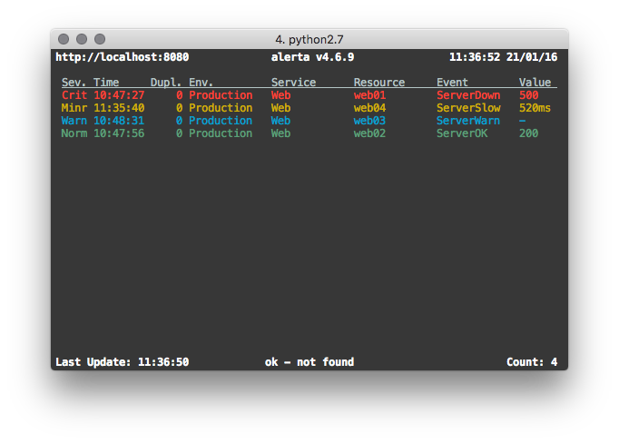

.. _cli:

Alerta CLI
==========

``alerta`` is the unified command-line tool, terminal GUI and Python SDK
for the alerta monitoring system.

It can be used to send and query alerts, tag alerts and change alert status,
delete alerts, dump alert history or see the raw alert data. It can also be
used to send heartbeats to the alerta server, and generate alerts based on
missing or slow heartbeats.

Installation
------------

The ``alerta`` client tool can be installed using pip::

    $ pip install alerta

Or, by cloning the git repository::

    $ git clone https://github.com/alerta/python-alerta-client.git
    $ cd python-alerta-client
    $ pip install .

.. _cli config:

Configuration
-------------

Options can be set in a configuration file, as environment variables or
on the command line. Profiles can be used to easily switch between different
configuration settings.

+-------------+-------------+-----------------------------------+---------------------------------+---------------------------+
| Option      | Config File | Environment Variable              | Optional Argument               | Default                   |
+=============+=============+===================================+=================================+===========================+
| file        |     n/a     | :envvar:`ALERTA_CONF_FILE`        | ``--config-file FILE``          | :file:`~/.alerta.conf`    |
+-------------+-------------+-----------------------------------+---------------------------------+---------------------------+
| profile     |  profile    | :envvar:`ALERTA_DEFAULT_PROFILE`  | ``--profile PROFILE``           | None                      |
+-------------+-------------+-----------------------------------+---------------------------------+---------------------------+
| endpoint    |  endpoint   | :envvar:`ALERTA_ENDPOINT`         | ``--endpoint-url URL``          | ``http://localhost:8080`` |
+-------------+-------------+-----------------------------------+---------------------------------+---------------------------+
| key         |  key        | :envvar:`ALERTA_API_KEY`          | n/a                             | None                      |
+-------------+-------------+-----------------------------------+---------------------------------+---------------------------+
| timezone    |  timezone   | n/a                               | n/a                             | Europe/London             |
+-------------+-------------+-----------------------------------+---------------------------------+---------------------------+
| timeout     |  timeout    | n/a                               | n/a                             | 5s TCP connection timeout |
+-------------+-------------+-----------------------------------+---------------------------------+---------------------------+
| ssl verify  |  sslverify  | :envvar:`REQUESTS_CA_BUNDLE`      | n/a                             | verify SSL certificates   |
+-------------+-------------+-----------------------------------+---------------------------------+---------------------------+
| output      |  output     | n/a                               | ``--output FORMAT``, ``--json`` | text                      |
+-------------+-------------+-----------------------------------+---------------------------------+---------------------------+
| color       |  color      | :envvar:`CLICOLOR`                | ``--color``, ``--no-color``     | color on                  |
+-------------+-------------+-----------------------------------+---------------------------------+---------------------------+
| debug       |  debug      | :envvar:`DEBUG`                   | ``--debug``                     | no debug                  |
+-------------+-------------+-----------------------------------+---------------------------------+---------------------------+

.. note:: The ``profile`` option can only be set in the ``[DEFAULT]`` section.

**Example**

Configuration file :file:`~/.alerta.conf`::

    [DEFAULT]
    timezone = Australia/Sydney
    output = json

    [profile development]
    endpoint = https://localhost:8443
    key = demo-key
    sslverify = off
    timeout = 10.0
    debug = yes

Set environment variables::

    $ export ALERTA_CONF_FILE=~/.alerta.conf
    $ export ALERTA_DEFAULT_PROFILE=production

Use production configuration settings by default::

    $ alerta query

Switch to development configuration settings when required::

    $ alerta --profile development query

Precedence
----------

Command-line configuration options have precedence over environment
variables, which have precedence over the configuration file. Within
the configuration file, profile-specific sections have precedence over
the ``[DEFAULT]`` section.

Authentication
--------------

If the Alerta API enforces authentication, then the ``alerta`` command-line
tool can be configured to present an API key or login to the API before
accessing secured endpoints.

**API Keys**

API keys can be generated in the web UI, or by an authenticated user using
the ``alerta`` CLI, and should be added to the configuration file as the "key"
setting as shown in the following example::

    [profile production]
    endpoint = https://api.alerta.io
    key = LMvzLsfJyGpSuLmaB9kp-8gCl4I3YZkV4i7IGb6S

**OAuth Login**

Alternatively, a user can "login" to the API and retrieve a Bearer token if
the Alerta API is configured to use either ``basic``, ``github``, ``gitlab``
or ``google`` as the authentication provider. No additional settings are
required but before running any commands the user must login first::

    $ alerta login

Commands
--------

The ``alerta`` tool is invoked by specifying a command using the
following format::

    $ alerta [OPTIONS] COMMAND [ARGS]...

.. contents::
   :local:
   :depth: 2

Alert Commands
~~~~~~~~~~~~~~

The following group of commands are related to sending, querying and managing
the status of alerts.

.. _cli_send:

:command:`send` - Send an alert
+++++++++++++++++++++++++++++++

Send an alert.

::

    $ alerta send [OPTIONS]

    Options:
    -r, --resource RESOURCE        Resource under alarm
    -e, --event EVENT              Event name
    -E, --environment ENVIRONMENT  Environment eg. Production, Development
    -s, --severity SEVERITY        Severity eg. critical, major, minor, warning
    -C, --correlate EVENT          List of related events eg. node_up, node_down
    -S, --service SERVICE          List of affected services eg. app name, Web,
                                    Network, Storage, Database, Security
    -g, --group GROUP              Group event by type eg. OS, Performance
    -v, --value VALUE              Event value
    -t, --text DESCRIPTION         Description of alert
    -T, --tag TAG                  List of tags eg. London, os:linux, AWS/EC2
    -A, --attributes KEY=VALUE     List of attributes eg. priority=high
    -O, --origin ORIGIN            Origin of alert in form app/host
    --type EVENT_TYPE              Event type eg. exceptionAlert,
                                    performanceAlert, nagiosAlert
    --timeout SECONDS              Seconds before an open alert will be expired
    --raw-data STRING              Raw data of orignal alert eg. SNMP trap PDU.
                                    '@' to read from file, '-' to read from stdin
    --customer STRING              Customer
    -h, --help                     Show this message and exit.

The only mandatory options are ``resource`` and ``event``. All the others will
be set to sensible defaults.

.. attention:: If the ``reject`` plugin is enabled (which it is by
    default) then alerts must have an ``environment`` attribute that
    is one of either ``Production`` or ``Development`` and it must
    define a ``service`` attribute. For more information on configuring
    or disabling this plugin see :ref:`plugin config`.

+------------------+-----------------------+
| Attribute        | Default               |
+==================+=======================+
| environment      | empty string          |
+------------------+-----------------------+
| severity         | ``normal``            |
+------------------+-----------------------+
| correlate        | empty list            |
+------------------+-----------------------+
| status           | ``unknown``           |
+------------------+-----------------------+
| service          | empty list            |
+------------------+-----------------------+
| group            | ``Misc``              |
+------------------+-----------------------+
| value            | ``n/a``               |
+------------------+-----------------------+
| text             | empty string          |
+------------------+-----------------------+
| tags             | empty list            |
+------------------+-----------------------+
| attributes       | empty dictionary      |
+------------------+-----------------------+
| origin           | program/host          |
+------------------+-----------------------+
| type             | ``exceptionAlert``    |
+------------------+-----------------------+
| timeout          | 86400 (1 day)         |
+------------------+-----------------------+
| raw data         | empty string          |
+------------------+-----------------------+

**Examples**

To send a ``minor`` alert followed by a ``normal`` alert that correlates::

    $ alerta send --resource web01 --event HttpError --correlate HttpOK --group Web --severity minor
    $ alerta send --resource web01 --event HttpOK --correlate HttpError --group Web --severity normal

To send an alert with custom attribute called ``region``::

    $ alerta send -r web01 -e HttpError -g Web -s major --attributes region="EU"

:command:`query` - Search for alerts
++++++++++++++++++++++++++++++++++++

Query for alerts based on search filter criteria.

**Examples**

To query for major and minor open alerts for the Production environment of the Mobile API service::

    $ alerta query --filter severity=major --filter severity=minor --filter status=open --filter environment=Production --filter service="Mobile API"

To query for all alerts with "disk" in the alert text::

    $ alerta query --filter text=~disk

:command:`ack` - Acknowledge alerts
+++++++++++++++++++++++++++++++++++

Acknowlege alerts ie. change alert ``status`` to ``ack``

:command:`close` - Close alerts
+++++++++++++++++++++++++++++++

Close alerts ie. change alert ``status`` to ``closed``.

:command:`unack` - Un-acknowledge alerts
++++++++++++++++++++++++++++++++++++++++

Unacknowledge alerts ie. change alert ``status`` to ``open``.

:command:`shelve` - Shelve alerts
+++++++++++++++++++++++++++++++++

Shelve alerts ie. change alert ``status`` to ``shelved`` which removes the
alerts from the active console and prevents any further notifications.

:command:`unshelve` - Un-shelve alerts
++++++++++++++++++++++++++++++++++++++

Unshelve alerts ie. change alert ``status`` to ``open`` which returns the
alerts to the active console and does not prevent future notifications.

:command:`tag` - Tag alerts
+++++++++++++++++++++++++++

Add tags to alerts.

:command:`untag` - Untag alerts
+++++++++++++++++++++++++++++++

Remove tags from alerts.

:command:`update` - Update alert attributes
+++++++++++++++++++++++++++++++++++++++++++

Update alert attributes.

:command:`delete` - Delete alerts
+++++++++++++++++++++++++++++++++

Delete alerts.

:command:`watch` - Watch alerts
+++++++++++++++++++++++++++++++

Watch for new alerts.

:command:`top` - Show top offenders and stats
+++++++++++++++++++++++++++++++++++++++++++++

Display alerts like unix "top" command.

:command:`raw` - Show alert raw data
++++++++++++++++++++++++++++++++++++

Show raw data for alerts.

:command:`history` - Show alert history
+++++++++++++++++++++++++++++++++++++++

Show action, status, severity and value changes for alerts.

Blackout Commands
~~~~~~~~~~~~~~~~~

The following group of commands are related to creating and
managing alert suppressions using blackouts.

:command:`blackout` - Suppress alerts
++++++++++++++++++++++++++++++++++++++

  blackout      Suppress alerts

:command:`blackouts` - List alert suppressions
+++++++++++++++++++++++++++++++++++++++++++++++

  blackouts     List alert suppressions

Heartbeat Commands
~~~~~~~~~~~~~~~~~~

The following group of commands are related to creating and
managing heartbeats.

.. _cli_heartbeat:

:command:`heartbeat` - Send a heartbeat
+++++++++++++++++++++++++++++++++++++++

Send or delete a heartbeat.

::

    $ alerta heartbeat [OPTIONS]

    Options:
      -O, --origin ORIGIN            Origin of heartbeat.
      -E, --environment ENVIRONMENT  Environment eg. Production, Development
      -s, --severity SEVERITY        Severity eg. critical, major, minor, warning
      -S, --service SERVICE          List of affected services eg. app name, Web,
                                     Network, Storage, Database, Security

      -g, --group GROUP              Group event by type eg. OS, Performance
      -T, --tag TAG                  List of tags eg. London, os:linux, AWS/EC2
      --timeout SECONDS              Seconds before heartbeat is stale
      --customer STRING              Customer
      -D, --delete ID                Delete hearbeat using ID
      -h, --help                     Show this message and exit.

.. note:: The "environment", "severity", "service" and "group" values are only
  used when heartbeat alerts are generated from slow or stale heartbeats.

.. _cli_heartbeats:

:command:`heartbeats` - List heartbeats
+++++++++++++++++++++++++++++++++++++++

List heartbeats and generate heartbeat alerts.

::

    $ alerta heartbeats [OPTIONS]

    Options:
      --alert                  Alert on stale or slow heartbeats
      -s, --severity SEVERITY  Severity for stale heartbeat alerts
      --timeout SECONDS        Seconds before a stale heartbeat alert will be expired
      --purge                  Delete all stale heartbeats
      -h, --help               Show this message and exit.

Alerts can be generated from stale or slow heartbeats using
the ``--alert`` option. It is expected that this would be run
at regular intervals using a scheduling service such as ``cron``.

Tags can be used to set the ``environment`` or ``group`` of a heartbeat
alert using the format ``environment:[ENV]`` and ``group:[GRP]``. These
tags will be visible in the heartbeat but removed as tags from the alert.

**Example**

To send a ``major`` alert with an environment of ``Infra`` in the ``Network``
group when a heartbeat is missed or slow for an origin called ``system1``::

    $ alerta heartbeat -O system1 -T environment:Infra -T group:Network --timeout 10
    (wait >10 seconds)
    $ alerta heartbeats --alert --severity major

API Key Commands
~~~~~~~~~~~~~~~~

The following group of commands are related to creating and
managing API keys.

:command:`key` - Create API key
+++++++++++++++++++++++++++++++++++

  key           Create API key

.. important::

    To prevent privilege escalation it is not possible to create an API key
    with associated roles that are greater than that with which that API key
    has.

:command:`keys` - List API keys
+++++++++++++++++++++++++++++++

  keys          List API keys

:command:`revoke` - Revoke API key
++++++++++++++++++++++++++++++++++

  revoke        Revoke API key  

User Commands
~~~~~~~~~~~~~

The following group of commands are related to creating and
managing users.

:command:`user` - Update user
+++++++++++++++++++++++++++++

  user          Update user

:command:`users` - List users
+++++++++++++++++++++++++++++

  users         List users

:command:`me` - Update current user
+++++++++++++++++++++++++++++++++++

  me            Update current user

Permissions Commands
~~~~~~~~~~~~~~~~~~~~

The following group of commands are related to creating and
managing roles, permissions and access control.

:command:`perm` - Add role-permission lookup
++++++++++++++++++++++++++++++++++++++++++++

  perm          Add role-permission lookup

:command:`perms` - List role-permission lookups
+++++++++++++++++++++++++++++++++++++++++++++++

  perms         List role-permission lookups

Customer Commands
~~~~~~~~~~~~~~~~~

The following group of commands are related to creating and
managing customers.

:command:`customer` - Add customer lookup
+++++++++++++++++++++++++++++++++++++++++

  customer      Add customer lookup

:command:`customers` - List customer lookups
++++++++++++++++++++++++++++++++++++++++++++

  customers     List customer lookups

Auth Commands
~~~~~~~~~~~~~

The following group of commands are related to authentication.

:command:`signup` - Sign-up new user
++++++++++++++++++++++++++++++++++++

  signup        Sign-up new user

:command:`login` - Login with user credentials
++++++++++++++++++++++++++++++++++++++++++++++

  login         Login with user credentials

:command:`logout` - Clear login credentials
+++++++++++++++++++++++++++++++++++++++++++

  logout        Clear login credentials

:command:`whoami` - Display current logged in user
++++++++++++++++++++++++++++++++++++++++++++++++++

  whoami        Display current logged in user

:command:`token` - Display current auth token
+++++++++++++++++++++++++++++++++++++++++++++

  token         Display current auth token

Admin Commands
~~~~~~~~~~~~~~

The following group of commands are related to administration.

.. _cli_status:

:command:`status` - Display status and metrics
++++++++++++++++++++++++++++++++++++++++++++++

Display API server switch status and usage metrics.

::

    $ alerta status
    METRIC                       TYPE     NAME                       VALUE        AVERAGE
    ---------------------------  -------  -------------------------  -------  -----------
    Total alerts                 gauge    alerts.total               993
    Rejected alerts              counter  alerts.rejected            22
    Alert queries                timer    alerts.queries             9132459  128.713
    Pre-receive plugins          timer    plugins.prereceive         10889      0.0383874
    Newly created alerts         timer    alerts.create              4442       5.06123
    Post-receive plugins         timer    plugins.postreceive        10867      0.0149995
    Received alerts              timer    alerts.received            15376     23.4729
    Duplicate alerts             timer    alerts.duplicate           9167       8.26061
    Correlated alerts            timer    alerts.correlate           429       20.9068
    Tagging alerts               timer    alerts.tagged              246       35.5935
    Alert status change          timer    alerts.status              687       88.2969
    Deleted alerts               timer    alerts.deleted             8        120.25
    Removing tags from alerts    timer    alerts.untagged            52        22.2308
    Count alerts                 timer    alerts.counts              4388289   23.9553
    Alerta console auto-refresh  text     switch.auto-refresh-allow  ON
    API alert submission         text     switch.sender-api-allow    ON

:command:`config` - Display remote client config
++++++++++++++++++++++++++++++++++++++++++++++++

Display client config downloaded from API server.

::

    $ alerta config
    audio               : {}
    auth_required       : True
    client_id           : 736147134702-glkb1pesv716j1utg4llg7c3rr7nnhli.apps.googleusercontent.com
    colors              : {}
    customer_views      : True
    dates               : {'longDate': 'EEEE, MMMM d, yyyy h:mm:ss.sss a (Z)', 'mediumDate': 'medium', 'shortTime': 'shortTime'}
    endpoint            : https://alerta-api.herokuapp.com
    github_url          : None
    gitlab_url          : https://gitlab.com
    keycloak_realm      : None
    keycloak_url        : None
    pingfederate_url    : None
    provider            : google
    refresh_interval    : 5000
    severity            : {'cleared': 5, 'critical': 1, 'debug': 7, 'indeterminate': 5, 'informational': 6, 'major': 2, 'minor': 3, 'normal': 5, 'ok': 5, 'security': 0, 'trace': 8, 'unknown': 9, 'warning': 4}
    signup_enabled      : True
    tracking_id         : UA-44644195-5

:command:`housekeeping` - Expired and clears old alerts
+++++++++++++++++++++++++++++++++++++++++++++++++++++++

Trigger the expiration and deletion of alerts.

:command:`uptime` - Display server uptime
+++++++++++++++++++++++++++++++++++++++++

Show how long the Alerta API has been running.
::

    $ alerta uptime
    01:06 up 0 days 16:15
  
:command:`version` - Display version info
+++++++++++++++++++++++++++++++++++++++++

Show version information for ``alerta`` and dependencies.

::

    $ alerta version
    alerta 6.0.0
    alerta client 6.0.0
    requests 2.19.1
    click 7.0

Help Commands
~~~~~~~~~~~~~

:command:`help` - Show this help
++++++++++++++++++++++++++++++++

Show all ``OPTIONS``, ``COMMANDS`` and some example ``FILTERS``.

Bugs
----

Log any issues on `GitHub`_ or submit a `pull request`_.

.. _`github`: https://github.com/alerta/python-alerta/issues
.. _`pull request`: https://github.com/alerta/python-alerta/pulls
