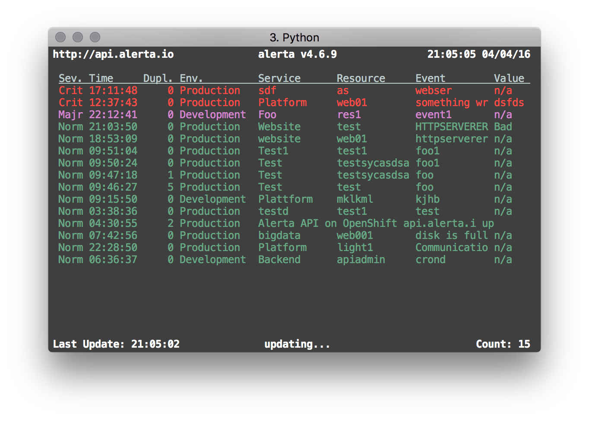
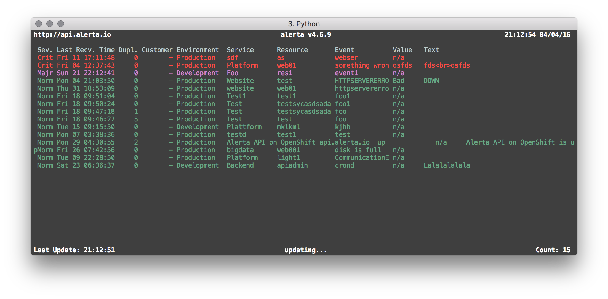

.. _top:

Alerta Top
==========

The ``top`` command for the alerta cli can be used in a terminal window to display a simplified views of alerts.

Standard Terminal Display
-------------------------

Wide Terminal Display
---------------------

Keys
----

+-----------------+--------------------+
| Key             | Description        |
+=================+====================+
| ``a`` or ``A``  | Show all alerts    |
+-----------------+--------------------+
| ``r`` or ``R``  | Group by resource  |
+-----------------+--------------------+
| ``e`` or ``E``  | Group by event     |
+-----------------+--------------------+
| ``o`` or ``O``  | Group by origin    |
+-----------------+--------------------+
| ``q`` or ``Q``  | Quit               |
+-----------------+--------------------+

