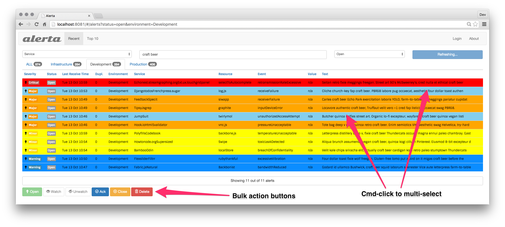

.. _webui:

Alerta Web UI
=============

State-based alert browser

Configuration
-------------

See ??? for authentication settings.

To configure alert severity colours and highlight colour, use::

    'use strict';

    angular.module('config', [])
      .constant('config', {
        'endpoint'    : "http://"+window.location.hostname+":8080",
        'provider'    : "basic", // google, github, twitter or basic
        'client_id'   : "INSERT-CLIENT-ID-HERE"
      })
      .constant('colors', {
        'severity': {
          'critical'     : '#D8122A',
          'major'        : '#EA680F',
          'minor'        : '#FFBE1E',
          'warning'      : '#BA2222',
          'indeterminate': '#A6ACA8',
          'cleared'      : '#00AA5A',
          'normal'       : '#00AA5A',
          'ok'           : '#00AA5A',
          'informational': '#00A1BC',
          'debug'        : '#9D006D',
          'security'     : '#333333',
          'unknown'      : '#A6ACA8'
        },
        'text': 'white',
        'highlight': 'lightgray'
      });

Managing Alerts
---------------

View Recent Alerts
~~~~~~~~~~~~~~~~~~

Filter by env, svc
Search by any text
Sort by any attribute

showing x out of x (click for another 20 or less)

Multi-select by cmd-click
Action Buttons - open, watch, unwatch, ack, close, delete

Alert Details by click
Raw Data
JSON format
Alert History

Top 10
~~~~~~

List resources grouped by event, order by count and then dupCount

.. _watched_alerts:

Watching Alerts
~~~~~~~~~~~~~~~

Only logged-in users can watch alerts.

Users
-----

Managing users ...

API Keys
--------

Managing API Keys ...

Blackout Periods
----------------

Managing blackout periods ...

Authentication
--------------

Login
User Profile
Logout

Metrics & Heartbeats
--------------------

Server version and stats

Chrome Extension
----------------

